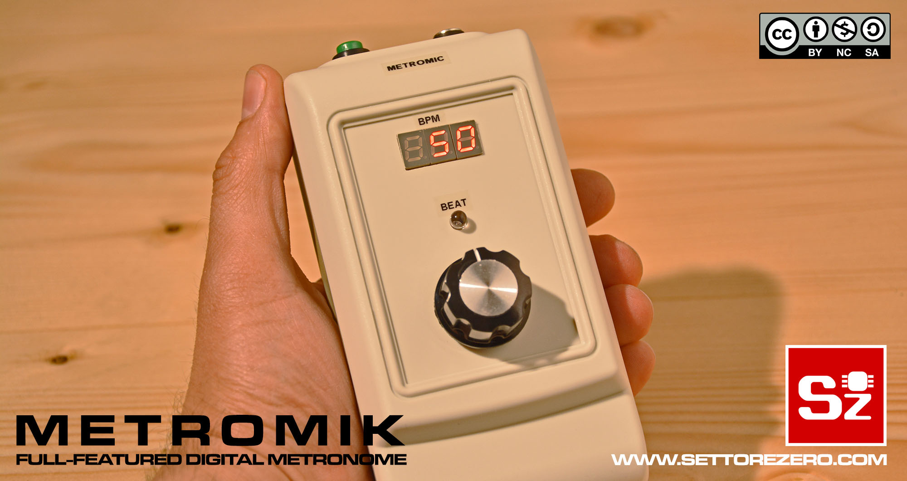

  

# MetroMik

MetroMik is a Digital Metronome I built for my son Michele, hence the name. It's based around a PIC16F1825. Project is made for MPLAB X Ide using XC8 compiler and MPLAB Code Configurator.  

Characteristics:
- Powered by a 18650 LiPo Cell
- Charging circuit
- BPM selection from 10 to 999
- Tempo selections: 2/4, ¾, 4/4
- Menù navigation using a rotary encoder
- 3 digits, 7-Segments led display
- Beating led
- Low battery indication on display

Full project specs [are listed here](https://www.settorezero.com/wordpress/metromik-metronomo-digitale-con-microcontrollore-pic/).  

Here is a video showing how it works:  
  

# Components used  
Those are sponsored links: if you buy some items following those links, you can support my works.
- [TP4056 Lipo Charging module with protection](https://amzn.to/3awQYoh)
- 18650 LiPo cell
- [SX1308 DC-DC Booster module](https://amzn.to/31LTz9M)
- [LM386 amplifier module](https://amzn.to/3iytzFy)
- 74HC595 Static Driving 3-digits 7-segments led display
- [PIC16F1825](https://amzn.to/33WuXho)
- [Rotary Encoder with pushbutton](https://amzn.to/2XTK5Ic)
- [LM1117-3.3 or LD33 Voltage regulator](https://amzn.to/30PDyQI)
- 4Ω 0.5W Speaker
- a bunch or resistors and capacitors [see schematic](documents/metromik_schematic.png)
- [Bahar Enclosures BMC-70012 enclosure](https://amzn.to/31Mw14r)
  
  
